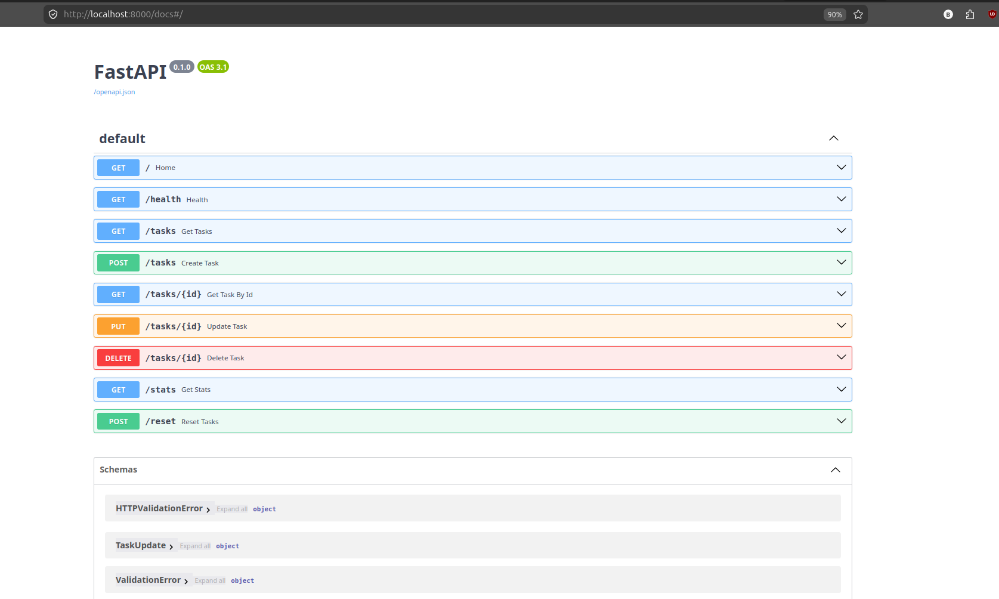

# Task API

A simple REST API built with **FastAPI** that demonstrates CRUD (Create, Read, Update, Delete) operations using an **in-memory data store**. The application manages a list of tasks without requiring a database, making it ideal for learning REST API fundamentals and FastAPI basics.

---

## Features

- In-memory task storage
- RESTful CRUD operations
- Proper HTTP status codes
- JSON request/response bodies
- FastAPI + Pydantic

---

## Installation & Run

Install the dependencies and start the server:

```bash
pip install fastapi uvicorn pydantic && uvicorn main:app --reload
```

The API will be available at:

```
http://127.0.0.1:8000
```

Interactive API documentation:

```
http://127.0.0.1:8000/docs
```
## Mortality Experiment

After creating several tasks and restarting the FastAPI server, all previously created tasks disappeared, leaving only the original sample tasks.
This behavior occurs because the application uses an **in-memory Python list** as its data store. Since the list exists only while the server process is running, restarting the server recreates the initial list and discards any tasks created during the previous session. No data is persisted to a file or database.
---

# API Endpoints

| Method | Endpoint | Description | Success Status |
|---------|----------|-------------|----------------|
| GET | `/` | API metadata | 200 OK |
| GET | `/health` | Health check | 200 OK |
| GET | `/tasks` | Retrieve all tasks | 200 OK |
| GET | `/tasks/{id}` | Retrieve a single task | 200 OK / 404 Not Found |
| POST | `/tasks` | Create a new task | 201 Created |
| PUT | `/tasks/{id}` | Update an existing task | 200 OK / 400 Bad Request / 404 Not Found |
| DELETE | `/tasks/{id}` | Delete a task | 204 No Content / 404 Not Found |
| GET | `/stats` | Returns task statistics | 200 OK |
| POST | `/reset` | Restore the initial sample tasks | 200 OK |

---

# Example curl Request

```bash
curl -i http://127.0.0.1:8000/tasks/1
```

Example response:

```http
HTTP/1.1 200 OK
date: Tue, 15 Jul 2026 10:15:42 GMT
server: uvicorn
content-length: 51
content-type: application/json

{
  "id": 1,
  "title": "Learn FastAPI",
  "done": false
}
```
## API Demo



---
## AI vs Me

The table below highlights some implementation differences between my Task API and an AI-generated reference implementation. While both expose the same RESTful CRUD functionality, the internal design choices differ.

| Feature | My Implementation | AI Reference |
|---------|-------------------|--------------|
| Error handling | Returns custom JSON responses (e.g., `{"error": "Task 99 not found"}`) to match the assignment specification. | Uses FastAPI's default `HTTPException`, which returns errors under the `detail` field. |
| Additional functionality | Includes **GET /stats** (task statistics) and **POST /reset** (restore sample tasks) as extra utility endpoints. | Only implements the core CRUD endpoints without statistics or reset functionality. |
| API metadata | Root endpoint dynamically returns metadata using FastAPI attributes (`app.title`, `app.version`) and exposes available endpoints. | Uses mostly hardcoded metadata values and endpoint listings. |

## Notes

- Tasks are stored in an in-memory Python list.
- Data is lost whenever the server restarts.
- The `/reset` endpoint restores the original sample tasks for testing.
