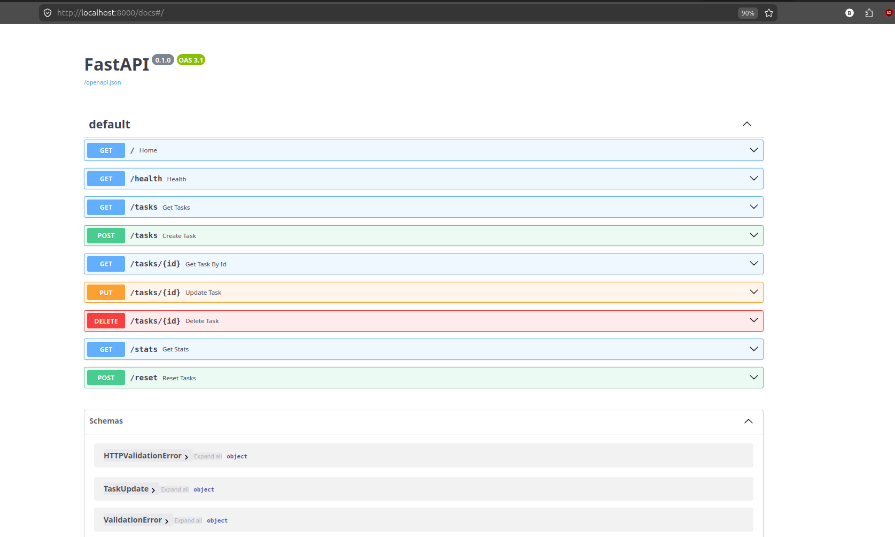
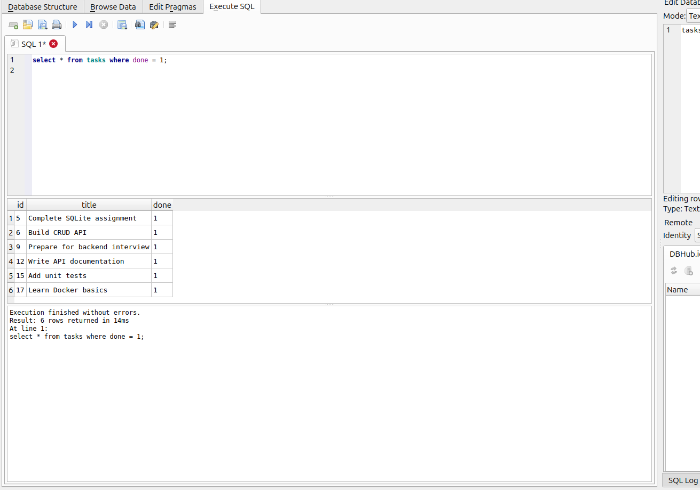
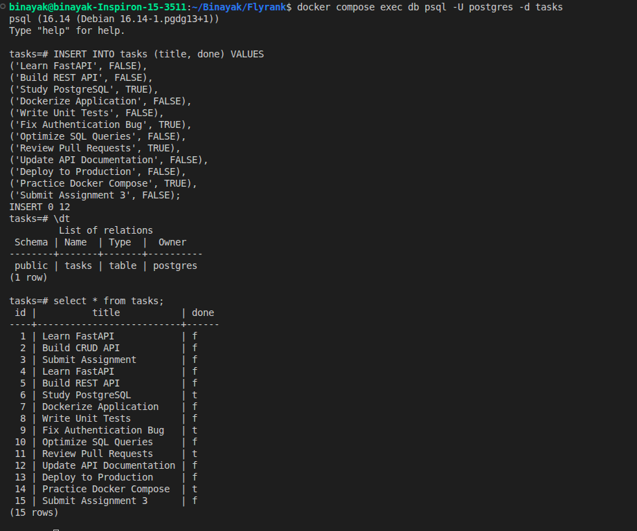

# Task API

A simple REST API built with **FastAPI** that demonstrates CRUD (Create, Read, Update, Delete) operations using an **in-memory data store**. The application manages a list of tasks without requiring a database, making it ideal for learning REST API fundamentals and FastAPI basics.

---

## Features

- In-memory task storage
- RESTful CRUD operations
- Proper HTTP status codes
- JSON request/response bodies
- FastAPI + Pydantic

---

## Installation & Run

Install the dependencies and start the server:

```bash
pip install fastapi uvicorn pydantic && uvicorn main:app --reload
```

The API will be available at:

```
http://127.0.0.1:8000
```

Interactive API documentation:

```
http://127.0.0.1:8000/docs
```
## Mortality Experiment

After creating several tasks and restarting the FastAPI server, all previously created tasks disappeared, leaving only the original sample tasks.
This behavior occurs because the application uses an **in-memory Python list** as its data store. Since the list exists only while the server process is running, restarting the server recreates the initial list and discards any tasks created during the previous session. No data is persisted to a file or database.
---

# API Endpoints

| Method | Endpoint | Description | Success Status |
|---------|----------|-------------|----------------|
| GET | `/` | API metadata | 200 OK |
| GET | `/health` | Health check | 200 OK |
| GET | `/tasks` | Retrieve all tasks | 200 OK |
| GET | `/tasks/{id}` | Retrieve a single task | 200 OK / 404 Not Found |
| POST | `/tasks` | Create a new task | 201 Created |
| PUT | `/tasks/{id}` | Update an existing task | 200 OK / 400 Bad Request / 404 Not Found |
| DELETE | `/tasks/{id}` | Delete a task | 204 No Content / 404 Not Found |
| GET | `/stats` | Returns task statistics | 200 OK |
| POST | `/reset` | Restore the initial sample tasks | 200 OK |

---

# Example curl Request

```bash
curl -i http://127.0.0.1:8000/tasks/1
```

Example response:

```http
HTTP/1.1 200 OK
date: Tue, 15 Jul 2026 10:15:42 GMT
server: uvicorn
content-length: 51
content-type: application/json

{
  "id": 1,
  "title": "Learn FastAPI",
  "done": false
}
```
## API Demo



---
## AI vs Me

The table below highlights some implementation differences between my Task API and an AI-generated reference implementation. While both expose the same RESTful CRUD functionality, the internal design choices differ.

| Feature | My Implementation | AI Reference |
|---------|-------------------|--------------|
| Error handling | Returns custom JSON responses (e.g., `{"error": "Task 99 not found"}`) to match the assignment specification. | Uses FastAPI's default `HTTPException`, which returns errors under the `detail` field. |
| Additional functionality | Includes **GET /stats** (task statistics) and **POST /reset** (restore sample tasks) as extra utility endpoints. | Only implements the core CRUD endpoints without statistics or reset functionality. |
| API metadata | Root endpoint dynamically returns metadata using FastAPI attributes (`app.title`, `app.version`) and exposes available endpoints. | Uses mostly hardcoded metadata values and endpoint listings. |

## Notes

- Tasks are stored in an in-memory Python list.
- Data is lost whenever the server restarts.
- The `/reset` endpoint restores the original sample tasks for testing.

# Assignment 2 - SQLite Persistence

This assignment extends the Task API by replacing the in-memory Python list with a **SQLite database**. The API behavior remains the same, but all task data is now stored in `tasks.db`, allowing it to persist across server restarts.

---

## What's New

- Replaced the in-memory task list with SQLite.
- Automatic database creation (`tasks.db`) on first run.
- Automatic creation of the `tasks` table using `CREATE TABLE IF NOT EXISTS`.
- Sample tasks are seeded only when the table is empty.
- CRUD operations now use SQL (`SELECT`, `INSERT`, `UPDATE`, `DELETE`) with parameterized queries.
- Added SQL-based search, filtering, and alphabetical sorting.

---

## Database Schema

| Column | Type | Description |
|---------|------|-------------|
| `id` | INTEGER PRIMARY KEY AUTOINCREMENT | Unique task identifier |
| `title` | TEXT | Task title |
| `done` | INTEGER | Completion status (`0` = False, `1` = True) |

---

## Persistence Check

Unlike Assignment 1, task data now survives server restarts.

**Steps performed:**

1. Created several tasks using the API.
2. Restarted the FastAPI server.
3. Called `GET /tasks`.
4. Verified that all previously created tasks were still present.

This confirms that the application now stores data in SQLite instead of volatile application memory.

---

## SQL Features Implemented

### Search Tasks

```http
GET /tasks?search=fastapi
```

Uses SQL:

```sql
SELECT * FROM tasks
WHERE title LIKE '%fastapi%';
```

---

### Filter Completed Tasks

```http
GET /tasks?done=true
```

Uses SQL:

```sql
SELECT *
FROM tasks
WHERE done = 1;
```

---

### Sort Alphabetically

All task queries are returned using:

```sql
ORDER BY title;
```

---

## SQL Queries Practiced

The following queries were executed directly in **DB Browser for SQLite**:

```sql
SELECT * FROM tasks;

SELECT * FROM tasks WHERE done = 1;

SELECT COUNT(*) FROM tasks;

UPDATE tasks
SET done = 1;

DELETE FROM tasks
WHERE done = 1;
```

These changes were immediately reflected in the API responses, demonstrating that both the application and DB Browser operate on the same SQLite database.

---

## API Compatibility

Although the storage layer changed from an in-memory list to SQLite, the REST API remained unchanged.

The same endpoints, request bodies, response formats, and HTTP status codes continue to work, making the database purely an implementation detail.

---



## AI vs Me

The AI-generated implementation and my implementation both provide a CRUD API, but they differ significantly in how data is managed.

| Feature | My Implementation | AI Reference |
|---------|-------------------|--------------|
| Storage | SQLite (`tasks.db`) | In-memory Python list |
| Data Persistence | Survives server restarts | Lost after every restart |
| CRUD | SQL (`SELECT`, `INSERT`, `UPDATE`, `DELETE`) | Python list operations |
| Primary Key | SQLite `AUTOINCREMENT` | `len(list) + 1` |
| Search & Filter | SQL (`LIKE`, `WHERE`, `ORDER BY`) | Not implemented |
| Error Handling | Custom JSON error responses | Mostly `HTTPException` |
| Query Safety | Parameterized SQL queries (`?`) | No database interaction |

---

## What I Learned

- How to integrate SQLite with FastAPI.
- How to create and initialize a database automatically.
- How to perform CRUD operations using SQL.
- How parameterized queries help prevent SQL injection.
- The difference between volatile in-memory storage and persistent database storage.
- How a REST API can keep the same interface while changing only its storage implementation.

# Assignment 3 – PostgreSQL & Dockerized Deployment

## Overview

This assignment extends the Task Management API by replacing SQLite with **PostgreSQL** for persistent storage and containerizing the application using **Docker** and **Docker Compose**. The API now runs as a complete multi-container application with a FastAPI service and a PostgreSQL database.

---

## What's New

- Migrated the database from **SQLite** to **PostgreSQL** using `psycopg`.
- Configured database connectivity using environment variables stored in a `.env` file.
- Automatically creates the `tasks` table during application startup.
- Seeds example tasks only when the database is empty.
- Replaced SQLite queries with PostgreSQL parameterized queries.
- Containerized the FastAPI application using **Docker**.
- Orchestrated the API and PostgreSQL services with **Docker Compose**.
- Added persistent Docker volumes to retain database data across container restarts.
- Enabled one-command application startup using Docker Compose.

---

## Technologies Used

- FastAPI
- PostgreSQL 16
- Psycopg
- Docker
- Docker Compose
- Python Dotenv

---

## Running the Project

### 1. Copy the environment file

```bash
cp .env.example .env
```

### 2. Start the application

```bash
docker compose up
```

The API will be available at:

```
http://localhost:8000
```

Swagger Documentation:

```
http://localhost:8000/docs
```

---

## Environment Variables

| Variable | Description |
|----------|-------------|
| `DATABASE_URL` | PostgreSQL connection string used by the application |

Example:

```text
DATABASE_URL=postgres://postgres:dev@db:5432/tasks
```

---

## Docker Architecture

```
Client
   │
   ▼
FastAPI Container
   │
   ▼
PostgreSQL Container
   │
   ▼
Docker Volume (Persistent Storage)
```

---

## Improvements over Assignment 2

| Assignment 2 | Assignment 3 |
|--------------|--------------|
| SQLite | PostgreSQL |
| Local execution | Dockerized deployment |
| Manual database setup | Docker Compose orchestration |
| Local database file | Persistent Docker volume |
| SQLite driver | Psycopg |
| Local configuration | Environment-based configuration |

---

## Learning Outcomes

- Connected FastAPI to PostgreSQL using `psycopg`.
- Used environment variables to securely manage database configuration.
- Implemented automatic database initialization and conditional data seeding.
- Executed parameterized SQL queries to improve security.
- Built and deployed the application using Docker.
- Managed multiple services using Docker Compose.
- Configured persistent storage using Docker volumes.
- Created a portable, one-command deployment workflow.

---

## Screenshots

### PostgreSQL Database



```sql
\dt
SELECT * FROM tasks;
```

### Docker Compose


```bash
docker compose up
```

showing both the API and PostgreSQL containers running successfully.

#### Without a Docker volume, PostgreSQL stores its data inside the container's writable layer. Removing the container deletes that layer, so all database data is lost. Docker volumes exist to persist data independently of the container lifecycle.

---

## AI vs Me (Assignment 3)

The table below highlights the differences in how the AI (in `ai_work/ai.py`) and I (in `main.py`) approached the migration to PostgreSQL and Docker in Assignment 3.

| Feature | My Implementation (`main.py`) | AI Reference (`ai_work/ai.py`) |
|---------|-------------------------------|--------------------------------|
| **Search & Filtering** | Fully implemented SQL-based filtering (`search`, `done`) in the `GET /tasks` endpoint using `ILIKE` and dynamic query building. | Only implements basic data retrieval (`SELECT *`). No query parameters or filtering added. |
| **Request Validation** | Uses raw query parameters (e.g., `title: str`) for `POST` requests, but uses Pydantic for `PUT`. | Consistently uses strict Pydantic data models (`TaskCreate`, `TaskUpdate`) for both `POST` and `PUT` body parsing. |
| **Additional Endpoints** | Retains the extra `/stats` and `/reset` utility endpoints. | Strictly sticks to the core CRUD operations and a `/health` check. |
| **Data Handling** | Explicit row indexing (`row[0]`, `row[1]`) with some legacy Python operations remaining. | Cleanly maps PostgreSQL rows to dictionaries explicitly upon fetch. |
| **Error Handling** | Uses `JSONResponse` across the board, explicitly matching Assignment 1's custom error formats. | Retained the exact same custom `JSONResponse` error formats for consistency with the previous AI version. |